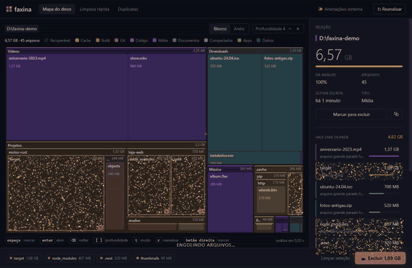
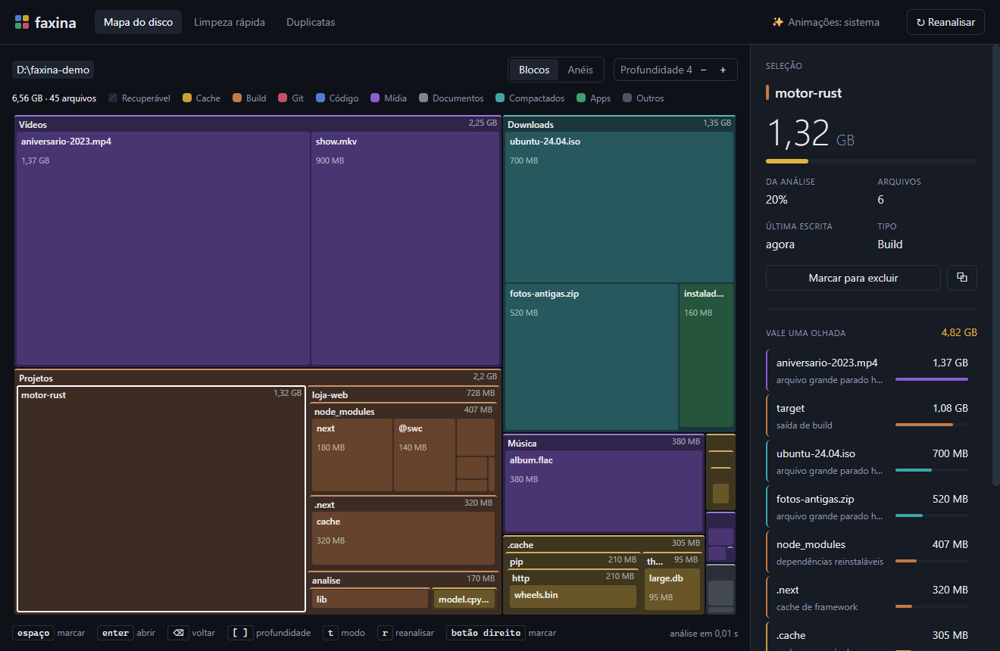
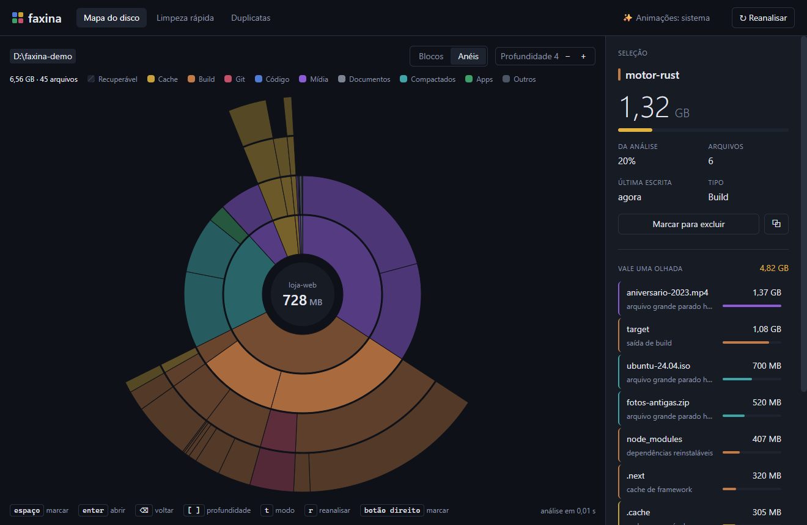
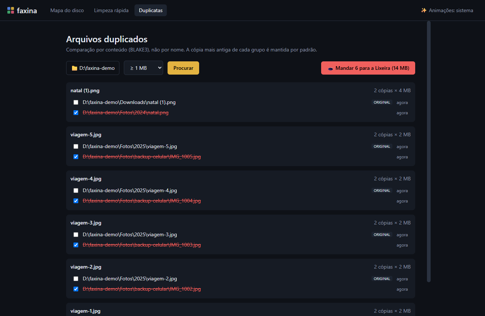
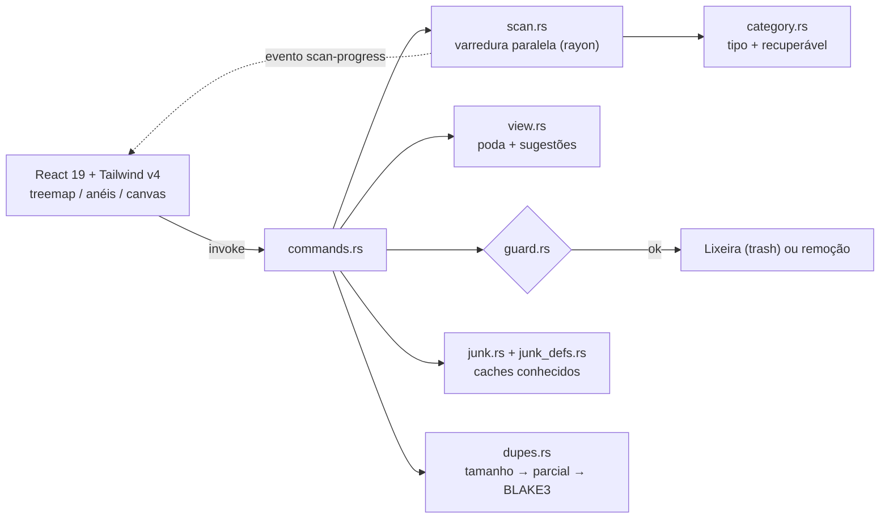
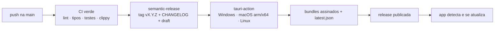

<div align="center">


# faxina

**Descubra onde foi parar o seu espaço em disco — e mande o lixo para um buraco negro.**

Mapa visual do disco no estilo DaisyDisk, limpeza de caches no estilo CCleaner e caçador de duplicatas por conteúdo, num app nativo leve feito com Tauri + Rust.

[](https://github.com/juninmd/faxina/releases/latest)
[](https://github.com/juninmd/faxina/actions/workflows/ci.yml)
[](LICENSE)

[](https://www.conventionalcommits.org/pt-br/)



</div>

---

## ✨ O que ele faz

| | |
|---|---|
| 🗺️ **Mapa do disco** | Treemap em blocos (estilo *disktree*) ou anéis concêntricos (estilo *DaisyDisk*). Cada cor é um tipo: cache, build, git, código, mídia, documentos, compactados, apps. Hachurado = **recuperável**. |
| 💡 **Vale uma olhada** | Lista automática do que dá para apagar sem dor: `node_modules`, `target/` de projetos Rust, `.next`, `__pycache__`, `.venv`, caches e arquivos gigantes parados há meses. |
| 🧹 **Limpeza rápida** | Caches de Windows, navegadores (Chrome, Edge, Brave, Firefox), apps (VS Code, Discord, Spotify) e ferramentas de dev (npm, Yarn, pip, Bun, Cargo, Gradle, Go, NuGet). **Nunca** toca em cookies, senhas ou histórico. |
| 👯 **Duplicatas** | Comparação por conteúdo em 3 etapas (tamanho → hash parcial → BLAKE3 completo). Mantém a cópia mais antiga e nunca deixa você marcar todas as cópias de um arquivo. |
| 🕳️ **Buraco negro** | Ao excluir, os blocos se desintegram, espiralam para dentro de um buraco negro, que colapsa numa onda de choque com o total liberado. |
| 🔄 **Auto-update** | O app verifica novas versões no GitHub Releases ao abrir; pacotes são assinados e você decide quando instalar. |

## 📸 Telas

<table>
  <tr>
    <td></td>
    <td></td>
  </tr>
  <tr>
    <td align="center"><sub>Blocos + “Vale uma olhada”</sub></td>
    <td align="center"><sub>Anéis estilo DaisyDisk</sub></td>
  </tr>
  <tr>
    <td colspan="2"></td>
  </tr>
</table>

<sub>Capturas feitas sobre uma pasta de demonstração gerada por <code>scripts/demo-fixture.ts</code>.</sub>

## ⬇️ Instalação

Baixe o instalador da [última versão](https://github.com/juninmd/faxina/releases/latest):

| Sistema | Arquivo |
|---|---|
| Windows 10/11 | `Faxina_x.y.z_x64-setup.exe` (ou `.msi`) |
| macOS Apple Silicon | `Faxina_x.y.z_aarch64.dmg` |
| macOS Intel | `Faxina_x.y.z_x64.dmg` |
| Linux | `.AppImage`, `.deb` ou `.rpm` |

> [!NOTE]
> Os binários ainda não têm assinatura de código da Microsoft/Apple. No Windows, o SmartScreen pede **Mais informações → Executar assim mesmo**; no macOS (assinatura ad-hoc), abra com **botão direito → Abrir** na primeira vez — se aparecer “danificado”, rode `xattr -cr /Applications/Faxina.app`. As *atualizações* são assinadas com a chave do updater do Tauri, então o app só aceita pacotes publicados por este repositório.

## 🔒 Segurança primeiro

- **Lixeira por padrão.** Exclusão permanente é opt-in, com confirmação.
- **O Rust não confia na interface.** Todo caminho enviado para exclusão passa por um guarda: precisa ser absoluto, sem `..`, existir, estar **dentro** da pasta analisada (nunca a própria raiz) e fora de pastas protegidas (sistema, `Arquivos de Programas`, sua pasta pessoal e Documentos/Imagens/Downloads inteiros).
- **Recuperável só por nome, nunca por cor.** Uma pasta cheia de `target/` é pintada de “Build”, mas só o `target/` é sugerido — o código-fonte ao lado fica.
- **Limpeza rápida por ID.** A interface manda o ID do cache (ex.: `chrome`), e o backend resolve os caminhos de uma lista fixa. Apaga o *conteúdo* da pasta, não a pasta; arquivos em uso são pulados e contados. Em `%TEMP%`, só o que tem mais de 24 h.
- **Links simbólicos e junctions são ignorados** na análise, então nada é contado duas vezes nem “escapa” da pasta escolhida.

## ⌨️ Atalhos

| Tecla | Ação |
|---|---|
| `Tab` | percorre os blocos do nível atual |
| `Enter` / duplo clique | abrir pasta |
| `Espaço` / botão direito | marcar ou desmarcar para excluir |
| `Backspace` / centro dos anéis | voltar um nível |
| `[` `]` | menos / mais profundidade |
| `t` | alternar Blocos ↔ Anéis |
| `r` | reanalisar |

> [!TIP]
> O Faxina respeita a configuração **“Efeitos de animação”** do sistema. Se ela estiver desligada, o buraco negro vira uma versão curta. Para ver a animação completa mesmo assim, clique em **✨ Animações** no topo até ficar em **sempre**.

## 🧭 Como funciona



- A varredura guarda a árvore em memória; arquivos menores que 512 KB viram um bloco “N arquivos pequenos” por pasta, o que mantém milhões de arquivos em algumas centenas de MB.
- A interface recebe só a fatia visível (profundidade + até 60 filhos por pasta) e pede mais ao navegar.
- Excluir atualiza a árvore em memória, sem precisar reanalisar.

## 🛠️ Desenvolvimento

Pré-requisitos: [Bun](https://bun.sh) ≥ 1.3, [Rust](https://rustup.rs) estável e os [pré-requisitos do Tauri](https://tauri.app/start/prerequisites/) do seu sistema.

```bash
bun install
bun tauri dev            # app com hot reload

bun run lint             # Biome
bun run typecheck        # tsc
bun run test             # testes do frontend (bun test)
cd src-tauri && cargo test && cargo clippy --all-targets -- -D warnings

bun scripts/demo-fixture.ts ./demo   # pasta falsa com caches, builds e duplicatas
```

### Releases e auto-update

O versionamento é 100% automático a partir de [Conventional Commits](https://www.conventionalcommits.org/pt-br/):

| Commit | Versão |
|---|---|
| `fix: ...` | patch — `1.0.0 → 1.0.1` |
| `feat: ...` | minor — `1.0.0 → 1.1.0` |
| `feat!: ...` ou `BREAKING CHANGE:` | major — `1.0.0 → 2.0.0` |
| `docs:`, `chore:`, `refactor:`, `test:`… | sem release |



PRs têm os commits validados pelo commitlint. Para publicar, o repositório precisa dos secrets `TAURI_SIGNING_PRIVATE_KEY` e `TAURI_SIGNING_PRIVATE_KEY_PASSWORD` (gerados com `bun tauri signer generate`); a chave pública fica em `src-tauri/tauri.conf.json`.

## ⚠️ Limitações conhecidas

- Tamanhos são **aparentes** (tamanho do arquivo), não espaço alocado — arquivos esparsos ou comprimidos pelo NTFS podem ocupar menos.
- No Windows, hard links não são detectados na busca de duplicatas (no macOS/Linux, sim).
- Arquivos pequenos (< 512 KB) aparecem agrupados e não podem ser marcados individualmente.
- A limpeza rápida só mexe em pastas do usuário; nada que exija administrador (Windows Update, `C:\Windows\Temp`).

## 🙏 Inspirações

Levantamento feito no GitHub em 27/09/2026:

| Projeto | O que aprendemos |
|---|---|
| [BleachBit](https://github.com/bleachbit/bleachbit) · [Winapp2.ini](https://github.com/MoscaDotTo/Winapp2) | Listas declarativas de caches seguros por aplicativo |
| [czkawka](https://github.com/qarmin/czkawka) · [fclones](https://github.com/pkolaczk/fclones) | Pipeline de duplicatas: tamanho → hash parcial → hash completo |
| [WinDirStat](https://github.com/windirstat/windirstat) · [SquirrelDisk](https://github.com/adileo/squirreldisk) | Treemap como forma principal de enxergar o disco |
| [kondo](https://github.com/tbillington/kondo) · [npkill](https://github.com/voidcosmos/npkill) | Reconhecer artefatos de build pelo tipo de projeto |
| [dua-cli](https://github.com/Byron/dua-cli) · [dust](https://github.com/bootandy/dust) · [gdu](https://github.com/dundee/gdu) | Varredura paralela rápida e navegação por teclado |
| [DaisyDisk](https://daisydiskapp.com/) · Microsoft PC Manager · CCleaner | Anéis, “coletor” antes de apagar e limpeza em um clique |

## 📄 Licença

[MIT](LICENSE) © juninmd
